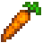
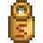
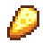
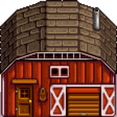
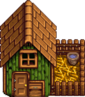
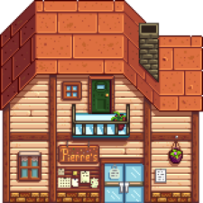

# 🎮 Oyun Raporu – `oyun.py`

## 👥 Proje Ekibi

- **Ad Soyad 1**: [Kamil AY 22253051]
- **Ad Soyad 2**: [Yusuf ALTUNBAY 22253072]
- **Ad Soyad 3**: [Abdurrahman EKİN 22253078]


---

## 📄 Genel Bilgi

Bu dosya, Python’un `pygame` kütüphanesi kullanılarak geliştirilmiş bir çiftlik temalı 2D oyun uygulamasıdır. Oyunda; bitki yetiştirme, hayvan bakımı, ürün toplama ve satışı gibi temel çiftlik mekanikleri bir araya getirilmiştir.

---

## 🧱 Kullanılan Sınıflar

- **`Player`**
- **`Tile`**
- **`Plant`**
- **`Inventory`**
- **`Menu` (Satın alma, satış)**
- **`Level`, `FarmLevel`**
- **`Transition`, `Overlay`, `Sky`**

---

## 🌀 Ana Oyun Döngüsü

```python
while running:
    for event in pygame.event.get():
        ...
    screen.blit(background, ...)
    draw_farm()
    draw_buildings()
    pygame.display.update()
    clock.tick(60)
```

---

## 🎨 Kullanılan Görseller

Aşağıda projede kullanılan tüm görseller listelenmiştir:

### Ürünler 











### Yapılar





### Oyun İçi Görüntüler
-
-


---


## 🎮 Kullanıcı Etkileşimleri

- **Yön Tuşları / WASD**: Hareket
- **Boşluk / B**: Hayvan etkileşimi (besleme / ürün toplama)
- **Enter**: Yapılarla etkileşim
- **C**: Envanter

---

## 🧩 Oyun Mekanikleri

### Tarım Sistemi
- Tarla sürme, tohum ekme, sulama ve hasat.

### Hayvancılık
- Tavuklardan yumurta, ineklerden süt toplama ve besleme sistemi.

### Market / Satış Sistemi
- Ürün satışı, tohum satın alma.
- Kamyon animasyonu ile satış bildirimi.

### İmalathane
- Ürün işleme (yoğurt, peynir, pasta vb.)
- Gereken malzemeler ve zaman bazlı üretim sistemi.

### Envanter
- Minecraft benzeri slot tabanlı yapı.

---

## ⏳ Zaman ve Animasyonlar

- Sulama sonrası zamanla ürün büyümesi.
- Hayvan beslenmesi sonrası yumurta/süt üretimi.
- Ağaçlar, araçlar ve karakter için animasyonlar.

---

## 💰 Ekonomik Sistem

- Ürün satışıyla gelir elde edilir.
- Gelir ile yeni tohumlar alınabilir.
- İmalathane ürünleri daha yüksek fiyata satılabilir.

---

## ✅ Sonuç

Bu proje, `pygame` kullanılarak geliştirilen kapsamlı bir çiftlik simülasyonudur. Oyuncuya tarım, hayvancılık, ticaret ve üretim gibi birden fazla oyun deneyimi sunmaktadır.

---
